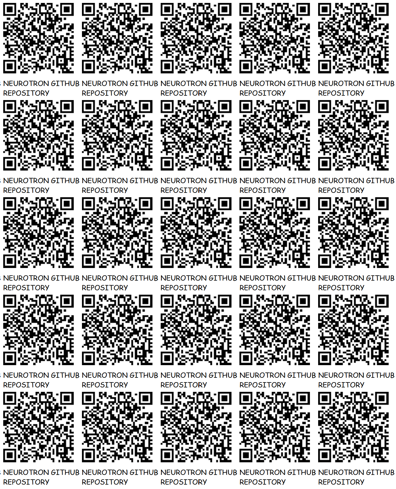

# [TRASH MAGIC NEUROTRON](https://github.com/LafeLabs/NEUROTRON)

 - [datafeed.html](datafeed.html)
 - [gihtub repository](https://github.com/LafeLabs/NEUROTRON)
 - [hyperspace.html](hyperspace.html)
 - [index.html](index.html)
 - [editor.php](editor.php)
 - [webeditor.html](webeditor.html)
 - [edit.html](edit.html)
 - [fork.html](fork.html)
 - [http://localhost](http://localhost)


[](images/qrcode.png)
[](images/qrcode-page.png)


OPEN SOURCE INSTRUMENT TO BUILD CYBERNETIC FEEDBACK LOOPS BETWEEN THE WORLD WIDE WEB AND THE LIVING SOIL!  WE SEEK OUT NONLINEARITIES AND USE THEM TO UPCONVERT THE VERY SLOW SIGNALS IN SOIL INTO THE AUDIO SIGNALS THAT HUMAN COMMUNICATION TECHNOLOGY USES FOR AUDIO SIGNALS(A FEW 10'S OF HZ THROUGH A FEW THOUSAND HZ).

```
data = {}
data.experiment = "notes about experiment";
data.starttime = Math.floor(Date.now() / 100)/10;//unix timestamp in seconds
data.startdate = Date();//date string of start 
data.timeseconds = [];//array of times in seconds from start
data.f1 = 1000;//frequency of fundamental tone in Hz
data.f2 = 2000;//frequency of second harmonic
data.f3 = 3000;//frequency of third harmonic
data.f4 = 4000;//frequency of fourth harmonic
data.p1 = [];//power at fundamental frequency
data.p2 = [];//power at second harmonic 
data.p3 = [];//power at third harmonic 
data.p4 = [];//power at fourth harmonic 
```

